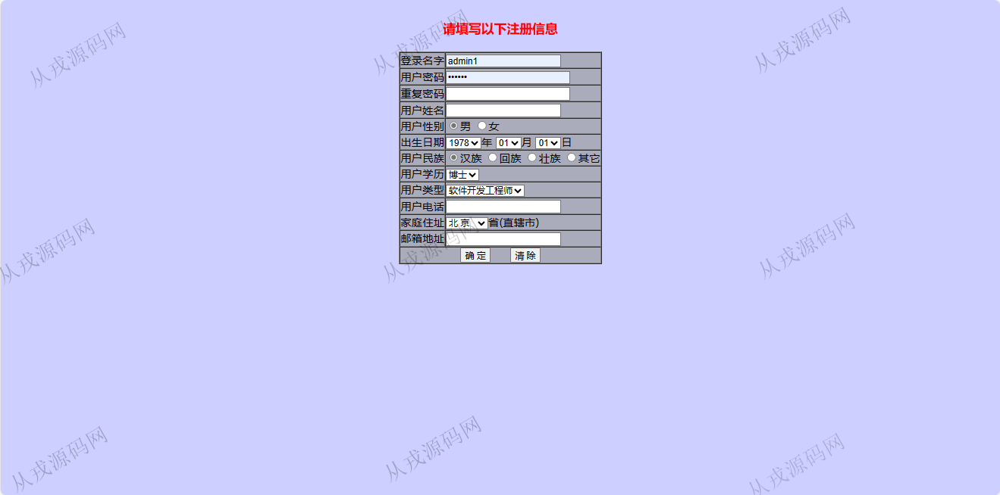
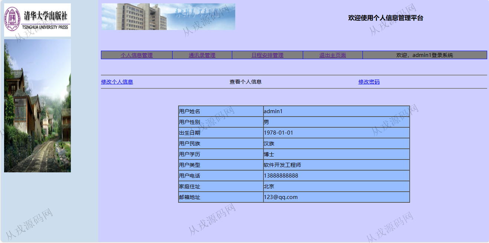
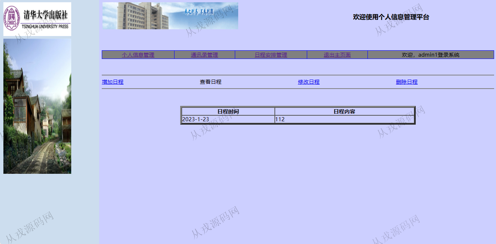
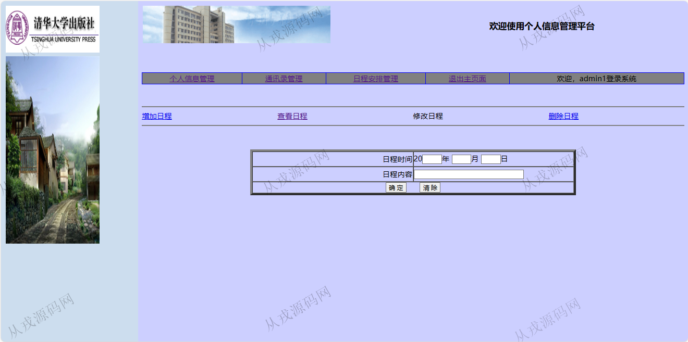
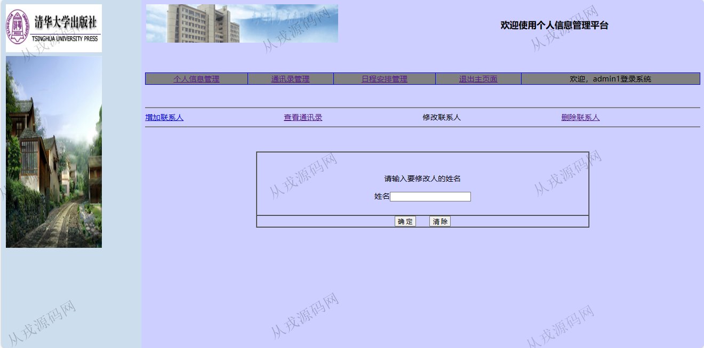

<h1 align="center">204.个人信息管理系统</h1>

 获取sql文件 QQ: 386869957 QQ群: 377586148 

 [更多源码项目: 从戎源码网](https://armycodes.com/) 

## 简介

> 本代码来源于网络,仅供学习参考使用!
>
> 提供1.远程部署/2.修改代码/3.设计文档指导/4.框架代码讲解等服务
> 
> http://localhost:8084/PIMS/login.jsp
> 
> admin1   admin1

## 项目介绍
基于java+jsp的个人信息管理系统：前端 jsp，后端 servlet、jdbc；集成个人信息管理、通讯录管理、日程安排管理等功能于一体的系统。

## 功能介绍

- 基本功能：登录，注册，退出
- 个人信息管理：个人信息查看，修改，密码修改
- 通讯录管理：通讯录信息的增删改查
- 日程安排管理：日程信息的增删改查

## 环境

- <b>IntelliJ IDEA 2021.3</b>

- <b>Mysql 5.7.26</b>

- <b>Tomcat 7.0.73</b>

- <b>JDK 1.8</b>

## 运行截图

